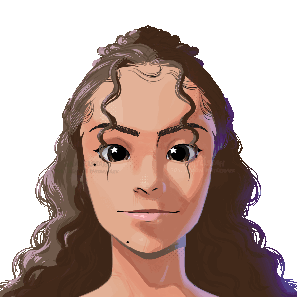

  
- I'm a Data Science nerd ☝️🤓  
- Currently working as a Data Analyst 🥧📊 
- Studying Advanced English, Web Development, and Data Structures 👩🏽‍💻🧩 
- My other interests include learning foreign languages, music, and art in general 🌎🎧 

 

  

    <h3>Contact me</h3>
    
      
      
    
  

  

    <h3>My stacks</h3>
    
      
      
      
      
      
      
    
  

### Github stats
 

   <a href="https://github.com/liapsps">
   
   

<picture>
  <source media="(prefers-color-scheme:dark)" scrset="https://raw.githubusercontent.com/liapsps/liapsps/output/github-contribution-grid-snake-dark.svg">
  
</picture>
  
